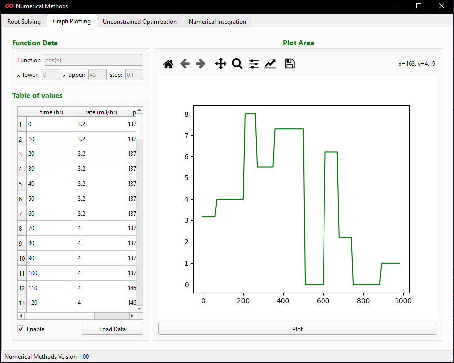

# Numerical Methods

Numerical Methods is a simple GUI application for solving mathematical problems that require some numerical methods.

With this application, numnerical methods for root solving, unconstrained optimization, numerical integration as well plotting graphs are available.

## Screenshots

 

 

 

## Prerequisites

Numerical Methods was created with `Python`, `PyQt6`, `numpy` and `matplotlib`.

* [Python3](https://www.python.org)
* [PyQt6](https://www.pypi.org/project/PyQt6)
* [numpy](httpls://www.pypi.org/project/numpy)
* [matplotlib](https://pypi.org/project/matplotlib)

## Author

* **Kelvin Addy**

## Acknowledgments
 
* I would like to thank Joshua Willamn, Author of Beginning-PyQt--second-edition, without the detailed explanation of everything about PyQt, i wouldn't have been able to get started on this project.

[NOTE] This project is not yet complete, i will be adding more features in the future. I you notice any bugs or additions you may want to add, feel free to contribute.

## How to Contribute

1. Make sure you have a GitHub account.
2. Fork the repository for the relevant book.
3. Create a new branch on which to make your change, e.g. 
`git checkout -b my_code_contribution`
4. Commit your change. Include a commit message describing the correction. Please note that if your commit message is not clear, the correction will not be accepted.
5. Submit a pull request.

Thank you for your contribution!